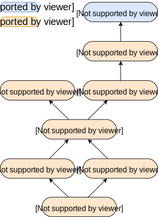

<!-- Meetup Info: -->
<!-- https://www.meetup.com/scaladores/events/248704833/ -->

<!--
See it in action:
- clone https://github.com/hakimel/reveal.js
- the the contents from presentation.html into reveal's index.html
- symlink this md file, and the imgs folder into reveal's root folder
- follow reveal's full setup instructions at https://github.com/hakimel/reveal.js#full-setup 
-->


## Web apps com programação funcional em scala

Paulo "JCranky" Siqueira

Software Engineer at Zalando SE

---

## Programação funcional PURA

O que é?

---

## Sem side-effects

Mas fazendo algo útil mesmo assim

---

## Com `Effect`s

Via **cats-effect**

---

## Transparência referencial

Podemos substituir uma referência por seu valor?

---

```scala
def printaHello: Unit = println("Olá Scaladores")

printaHello
printaHello
```

```scala
// Olá Scaladores
// Olá Scaladores
```

---

```scala
def printaHello: Unit = println("Olá Scaladores")

val hello = printaHello
hello
hello
```

```scala
// Olá Scaladores
```

---

## Laziness

Não seja como `Future` ;)

---

## Composição

Dada a transparência referencial, composição é fácil

---

## Entra em cena `cats.effect.IO`

---

```scala
def printaHello: IO[Unit] = IO(println("Olá Scaladores!"))

for {
  _ <- printaHello
  _ <- printaHello
} yield ()

val hello = printaHello
for {
  _ <- hello
  _ <- hello
} yield ()
```

---

## Nada!

---

## Execução **explícita**

---

```scala
val program = 
  for {
    _ <- printaHello
    _ <- printaHello
  } yield ()
```

```scala
program.unsafeRunSync
```

---

```scala
val hello = printaHello
val program = 
  for {
    _ <- hello
    _ <- hello
  } yield ()
```

```scala
program.unsafeRunSync
```

---

### `.unsafeRunSync`

apenas no fim do mundo e em testes!

---

## Abstrações

---

## **MUITAS** abstrações

`Functor`s, `Applicative`s, `Semigroup`s, `Monoid`s, `Monad`s, `Kleisli`s, `Effect`s, IO ...

---

## Ferramentas

O eco-sistema já está muito maduro

---

## http4s

---

## "Scala interface for http"

---

## Tipagem forte

Afinal, this..is..Scala!

---

## Encoding / decoding json

Qualquer biblioteca, mais usado com circe

---

## **Cats** para as principais abstrações

`Functor`s, `Applicative`s, `Semigroup`s, `Monoid`s, `Monad`s, `Kleisli`s ...

---

## "Tiquinho" de tagless final

---

## Cats-effect para I/O

`Sync`, `Async`, `Effect`, IO

---

## IO Monad!

Na verdade, `F[_]` pode ser qualquer `Effect`.

**Monix Task**, por exemplo.

---

```scala
def printaHello: IO[Unit] =
  IO(println("Olá Scaladores!"))
```

---

```scala
def printaHello[F[_]: Sync]: F[Unit] =
  Sync[F].delay(println("Olá Scaladores!"))

val helloIO: IO[Unit] = printaHello[IO]
val helloTask: Task[Unit] = printaHello[Task]
```

---

## Hierarquia cats-effect

Extraída da documentação oficial

---



---

## **fs2** para streaming

Primitiva fundamental do **http4s**, usado para o corpo de **request**s e **response**s

---

## Fundamento **http4s**

Função de `Request` para `F[Response]`

---

## Exemplo: Proxying requests

_ProxyService.scala_

---

## Exemplo: Endpoint rest

_ItemsService_

---

## Bonus: `ComposedServer.scala`

---

## HttpService, para os curiosos
    
```scala
type HttpService[F[_]] =
  Kleisli[OptionT[F, ?], Request[F], Response[F]]
```

---

## Referências

https://typelevel.org/cats

https://typelevel.org/cats-effect

https://functional-streams-for-scala.github.io/fs2

http://http4s.org/

---

## Perguntas ?!

---

## Obrigado!

twitter: @jcranky

github: github.com/jcranky
