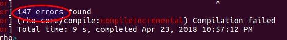
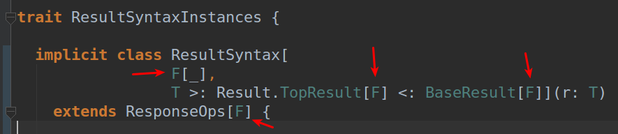
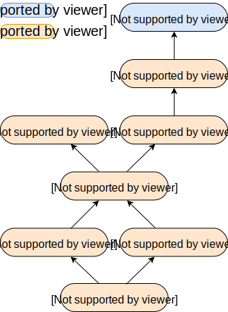

<!--
See it in action:
- clone https://github.com/hakimel/reveal.js
- copy the contents from presentation.html into reveal's index.html
- symlink this md file, and the imgs folder into reveal's root folder
- follow reveal's full setup instructions at https://github.com/hakimel/reveal.js#full-setup 
-->


## Learning cats-effect by Accident

Paulo "JCranky" Siqueira

Software Engineer at Zalando SE

@jcranky

---

First things first:

_Open Source is awesome!_

Note: it is the reason I'm here, lots of opportunities to learn and to help people

---

## agenda

- what are http4s, rho and cats-effect
- http4s: history
- the journey from zero to contributor

Note: 'the journey' is a reference to the way from knowing nothing about rho/http4s/cats-effect to being a contributor

---

## http4s

- FP HTTP Scala library (client and server)
- (currently) implies using cats, cats-effect and fs2

---

## rho

- a DSL for http4s
- extracts metadata from route definitions
- generates swagger documentation

---

### http4s dsl

```scala
val service = HttpService[F] {
  case GET -> Root / "orders" / id =>
    Ok(Json.obj("order_id" -> Json.fromString(id)))
}
```

---

### rho dsl

```scala
val service = new RhoService[F] with SwaggerSyntax[F] {
  "Get orders for a given id" **
    GET / "orders" / pathVar[Int] |>> { orderId: Int =>
      Ok(Json.obj("order_id" -> Json.fromInt(orderId)))
    }
  }
```

---

## cats-effect

- FP way of dealing with IO in Scala
- the leverage to enable pure FP applications

Note: the two sentences are different ways of saying the same thing

---

## http4s through the ages

Note: or, a bit of http4s history

---


---


---


---


---

## bonus point:

fs2.Task is no more, replaced by cats-effect `IO`

Note: fs2.Task was deprecated and removed from fs2 itself, and fs2 now also uses cats-effect IO

---

## back to October, 2017

---

### We wanted to migrate our library to cats(-effect), with the rest of the ecosystem.

Note: we didn't want to get stuck with an old http4s (and other lib's) versions.

---

### http4s was migrated, but rho not


---

### rho was missing the iron age: cats-effect!

---

So I decided:

### "I'll do it! How hard can it be?!"

Note: Oláfur stole my sentence! lol ;)

---


Note: Exactly, how hard?! Well, maybe there was a reason why this hasn't been done yet ;)

---

https://github.com/http4s/rho/pull/193


---

Changed the http4s version in sbt and...

Note: from 0.17.x to 0.18.y

---



---

### That was for `rho-core`!

What about other modules, and all test packages?!

Note: i.e. the errors in the previous slide were just part of it.

---

Keep in mind:

`rho` ab(uses) the type system

Note: so that it can derive the necessary information for swagger generation.

---

### First coding step: `F[_]` everywhere

tagless final maybe?

Note: is this tagless final?

---

Why? That is what http4s was doing ;)

---


Note: point being: just abstract a "container" for something.

---

One step further and...

---


Note: I find this huge type list, which needs yet another type.

---


---


Note: `F` both on the type definitions and on the `Result` instantiation.

---


---


---



---

Next: Add / fix implicits all over the place...

---


---

And then:

```scala
class C1[F[_]: Monad]
class C2[F[_]: Applicative]
class C3[F[_]: Sync]
```

Or: learn to restrict `F[_]`

---


---


---

We still have a problem...

Note: in a few places.

---


---

### implicits juggling


Note: if you want to "rage against the machine", I mean, against the scala compiler...

---


---

### Diversion: type recursion?


The type has to be carried around to be used by the `Response` class.

---

## Fixing tests

- we reach the "end of the world"

- drop `F[_]` and hardcode `IO` (or your preferred `Effect` implementation)

Note: and need to choose how to run our services.

---


---

### Diversion: cats-effect hierarchy



---

And that is how I ended up learning cats-effect!

---

Bonus: exposure to datatypes I was not used to (other than cats-effect ones)

```scala
OptionT
EitherT
Kleisli
```

and others from _cats_

---

Food for thought:

`F: Effect`
 
vs.

`F: Applicative`, `F: Monad` etc

---

### Key take away:

### Want to learn something?

#### Pick an OS project you use, find something that could be better, do it.

Note: Something challenging, but not completely out of the park.

---

### Don't be afraid to ask for help: gitter #ftw

Note: maybe not all communities are very receptive, and asking for help can help you also measure that.

---

## Life is short for bad communities

---

## Thank you! Questions?!

---


## We are hiring!
